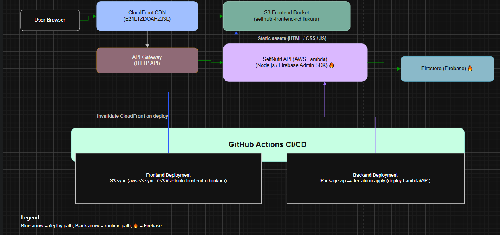

# Selfnutri – Cloud Computing Final Project (MSIT-3470)

<p align="center">
  
</p>


The final, live application is accessible here: **[https://d3tuac21giuzpq.cloudfront.net/](https://d3tuac21giuzpq.cloudfront.net/)**

## Table of Contents

* [1) Project Overview & Features](#1-project-overview--features)
* [2) Architecture & Technical Decisions](#2-architecture--technical-decisions)
* [3) API Details (Write & Read Paths)](#3-api-details-write--read-paths)
* [4) SLO & Monitoring Plan](#4-slo--monitoring-plan)
* [5) Deployment & Run Instructions](#5-deployment--run-instructions)
* [6) Team, Roles, and AI Usage](#6-team-roles-and-ai-usage)

---

## 1) Project Overview & Features

**Selfnutri** is a lightweight personal health and nutrition tracker that lets users quickly log daily meals and water intake, then review their history and progress over time. The goal is to demonstrate a secure, serverless cloud architecture with real write/read paths.

**Core Features:**

* **Write Path:** Users submit a new entry via the frontend, which calls a `POST /logs` API to write a document into a managed Firestore database.
* **Read Path:** Users view history powered by a `GET /logs` API that queries Firestore and returns the results to the UI.
* **Future/Optional:** Upload images or files to S3 for tracking meal photos or nutrition files.

---

## 2) Architecture & Technical Decisions

The application uses a hybrid serverless design: AWS provides static hosting, CDN, and API execution, while Google Cloud Firestore is used as the managed NoSQL database.

### Architecture Diagram

<p align="center">

</p>

### Core Cloud Components

| Layer                  | Component(s)                     | Resource Detail |
|------------------------|---------------------------------|----------------|
| **Frontend Delivery**   | AWS CloudFront (CDN)            | URL: `https://d3tuac21giuzpq.cloudfront.net/` |
| **Frontend Hosting**    | AWS S3 (Static Hosting)         | HTML/CSS/JS stored in `selfnutri-frontend-rchilukuru` bucket |
| **Backend API**         | AWS API Gateway + Lambda        | Executes business logic; connects to Firestore |
| **Data Persistence**    | Google Firestore (NoSQL DB)    | Stores meal/water logs |
| **Object Storage**      | AWS S3 (Data Bucket)            | Bucket ARN: `arn:aws:s3:::selfnutri-data-rchilukuru` |

### Security & Operational Focus

* **CloudFront Origin Access Control (OAC):** Frontend S3 bucket only accessible through CloudFront distribution.
* **Least-Privilege IAM:** Lambda and CI/CD use dedicated roles.
* **Secrets:** Stored via environment variables; no credentials committed.

---

## 3) API Details (Write & Read Paths)

| Path     | Method | Description | Data Operation |
|----------|--------|-------------|----------------|
| `/logs`  | POST   | Accepts JSON payloads for new logs (meal/water entries). | Write to Firestore |
| `/logs`  | GET    | Returns all existing logs as JSON. | Read from Firestore |

### Example API Requests

```bash
# Create a new log (Write Path)
curl -X POST https://l38jxggdfh.execute-api.us-west-2.amazonaws.com/logs \
  -H "Content-Type: application/json" \
  -d '{"type":"water","amount":500,"date":"2025-12-13"}'

# Fetch all logs (Read Path)
curl https://l38jxggdfh.execute-api.us-west-2.amazonaws.com/logs
